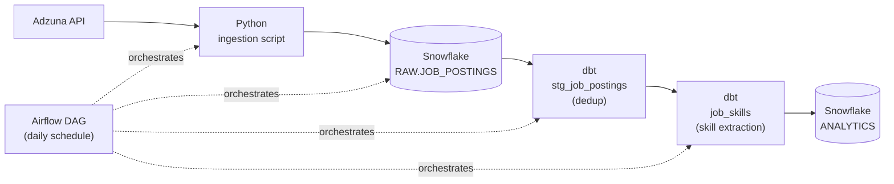

# Data Engineer Job Market Tracker

**A live data pipeline that tracks what data engineering job postings actually ask for.**

[](https://xjiang16.github.io/job-market-tracker/)


---

## What this is

A pipeline that pulls live job postings from the **Adzuna API**, lands them in **Snowflake**, transforms and validates them with **dbt**, and runs end-to-end daily via **Apache Airflow**—built to answer one question:

> **What do data engineering job postings actually ask for, and how often do they mention specific tools?**

** [View the live results page](https://xjiang16.github.io/job-market-tracker/)**

---

## Table of Contents

- [Architecture](#architecture)
- [What the data shows](#what-the-data-shows)
- [Tech stack](#tech-stack)
- [Project structure](#project-structure)
- [Setup](#setup)
- [Running the pipeline](#running-the-pipeline)
- [Data quality](#data-quality)
- [Roadmap](#roadmap)
- [What I learned building this](#what-i-learned-building-this)

---

## Architecture



Every run:

- Pull postings across multiple job titles and locations
- Load raw JSON into Snowflake (append-only)
- Deduplicate by job ID using dbt (keeping the most recently loaded version)
- Detect mentions of Python, SQL, Airflow, Snowflake, and dbt
- Execute the entire pipeline through Airflow in dependency order

---

## What the data shows

Current snapshot: **94 postings** after deduplication.

| Tool | Mentioned in | Share |
|------|-------------:|------:|
| SQL | 10 postings | 10.6% |
| Python | 6 postings | 6.4% |
| Snowflake | 3 postings | 3.2% |
| Airflow | 1 posting | 1.1% |
| dbt | 1 posting | 1.1% |

The most notable finding is that **85% of postings (80 out of 94) mention none of these five tools explicitly**.

Instead, most postings describe responsibilities in general terms such as *"build data pipelines"* or *"own the data platform"* rather than naming a specific technology stack. SQL is the only skill mentioned frequently enough to stand out.

This is an intentionally small sample built while actively job hunting. Expanding keyword coverage and collecting data over a longer period will produce more representative trends (see the roadmap below).

---

## Tech Stack

| Layer | Tool | Why |
|-------|------|-----|
| Source | Adzuna API | Free API aggregating postings from thousands of employers |
| Ingestion | Python (`requests`) | Lightweight and easy to test |
| Warehouse | Snowflake | Modern cloud data warehouse with independent compute/storage |
| Transformation | dbt | Version-controlled SQL models with dependency management and testing |
| Orchestration | Apache Airflow | Industry-standard workflow scheduler |
| Secrets | `python-dotenv` | Keeps credentials out of source control |

---

## Project Structure

```text
job-market-tracker/
├── ingest.py
├── load_to_snowflake.py
├── requirements.txt
├── .env.example
├── data/
│   └── raw/
├── job_market_tracker_dbt/
│   ├── models/
│   │   ├── sources.yml
│   │   ├── schema.yml
│   │   ├── stg_job_postings.sql
│   │   └── job_skills.sql
│   └── dbt_project.yml
├── docs/
│   └── index.html
└── README.md
```

> **Note:** Airflow's DAG file lives outside this repository in `~/airflow/dags/`, since Airflow manages its own DAG directory independently.

---

## Setup

### 1. Clone the repository

```bash
git clone https://github.com/xjiang16/job-market-tracker.git
cd job-market-tracker

python3 -m venv .venv
source .venv/bin/activate

pip install -r requirements.txt
pip install dbt-snowflake
```

---

### 2. Configure credentials

Copy:

```text
.env.example
```

to:

```text
.env
```

Fill in:

- Adzuna API credentials
- Snowflake account
- User
- Password
- Warehouse
- Database
- Schema

---

### 3. Create Snowflake objects

```sql
CREATE DATABASE JOB_MARKET_TRACKER;
CREATE SCHEMA JOB_MARKET_TRACKER.RAW;

CREATE TABLE JOB_MARKET_TRACKER.RAW.JOB_POSTINGS (
    job_id STRING,
    title STRING,
    company STRING,
    location STRING,
    salary_min FLOAT,
    salary_max FLOAT,
    created_date TIMESTAMP,
    description STRING,
    search_keyword STRING,
    search_location STRING,
    loaded_at TIMESTAMP DEFAULT CURRENT_TIMESTAMP()
);
```

---

### 4. Configure dbt

Initialize dbt:

```bash
dbt init
```

Configure `~/.dbt/profiles.yml` to point to your Snowflake account using the `ANALYTICS` schema.

---

### 5. Configure Airflow *(optional)*

Airflow should be installed in its own virtual environment.

Place the DAG file in:

```text
~/airflow/dags/
```

The DAG references this project's virtual environment directly to execute:

- `ingest.py`
- `load_to_snowflake.py`
- `dbt run`
- `dbt test`

---

## Running the Pipeline

### Manual execution

```bash
python ingest.py

python load_to_snowflake.py

cd job_market_tracker_dbt

dbt run

dbt test
```

---

### Scheduled execution

```bash
airflow standalone
```

Enable the `job_market_tracker` DAG in the Airflow UI (`http://localhost:8080`) to execute the entire workflow automatically on its schedule.

---

## Data Quality

dbt validates the transformed data on every run:

- `not_null`
- `unique`
- One row per `job_id` after deduplication

The raw ingestion layer is intentionally append-only.

Duplicate records are preserved in the raw table so transformations can be rerun later if business logic changes.

---

## Roadmap

- [x] Adzuna ingestion
- [x] Secure credentials with `.env`
- [x] Snowflake raw layer
- [x] dbt staging model
- [x] Skills extraction model
- [x] dbt tests
- [x] Airflow orchestration
- [x] Public results page
- [ ] Larger keyword/location coverage
- [ ] NLP-based skill extraction
- [ ] Additional job sources (company ATS boards)

---

## What I Learned Building This

This project served as a hands-on introduction to several technologies I hadn't previously used in production:

- Snowflake's warehouse/database/schema architecture
- dbt's dependency graph (`ref()` and `source()`)
- Airflow DAG scheduling and orchestration

Along the way I debugged several real-world issues, including:

- Python virtual environment mismatches
- Airflow installation and metadata migration conflicts
- Git merge conflicts after repository initialization

None of these problems were solved in one step. Like most data engineering work, each issue was resolved by reading logs, isolating failures, and debugging incrementally.

---

## Author

**Xiaoqi Jiang**

- GitHub: https://github.com/xjiang16
- LinkedIn: https://www.linkedin.com/in/xjiang16