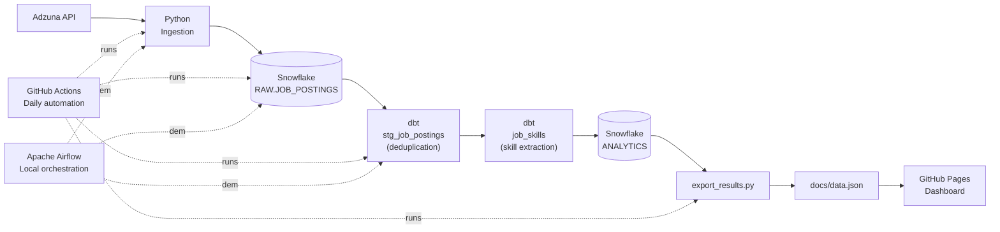

# Data Engineer Job Market Tracker

**An automated data pipeline that tracks what data engineering job postings actually ask for.**

[](https://xjiang16.github.io/job-market-tracker/)


## What this is

A data pipeline that pulls job postings from the **Adzuna API**, lands them in **Snowflake**, transforms and validates them with **dbt**, and automatically refreshes a public dashboard through **GitHub Actions**.

The pipeline is also orchestrated locally with **Apache Airflow** to demonstrate production-style workflow scheduling and dependency management.

Built to answer one question:

> **What do data engineering job postings actually ask for, and how often do they mention specific tools?**

** [View the results page — auto-updated daily](https://xjiang16.github.io/job-market-tracker/)**


## Local demo (no Snowflake needed)

The full pipeline needs a Snowflake account and Adzuna API keys — which meant nobody
without those could ever run the dbt models or check that they actually work, not a
reviewer, not a contributor, not even CI. `demo/` runs the real, unmodified dbt models
against [DuckDB](https://duckdb.org/) and small fixture data instead:

```bash
pip install -r requirements-dev.txt
python demo/seed.py
cd job_market_tracker_dbt
dbt run  --profiles-dir ../demo
dbt test --profiles-dir ../demo
```

See [`demo/README.md`](demo/README.md) for what this does and doesn't prove.


## Local frontend preview

`docs/index.html` is a plain static file — no build step, no framework. Preview a
visual change (a new chart, a layout tweak) locally instead of waiting on a GitHub
Pages deploy:

```bash
cd docs
python3 -m http.server 8000
```

Then open `http://localhost:8000`. Opening the file directly (double-click, or a
`file://` URL) won't work — the page loads `data.json` and `data_history.json` via
`fetch()`, which browsers block from a `file://` origin under CORS.

To preview a specific change to the trends chart before real history has
accumulated, temporarily drop a few sample rows into `docs/data_history.json`,
refresh the browser tab, then revert the file before committing.


## Table of Contents

- [Local demo (no Snowflake needed)](#local-demo-no-snowflake-needed)
- [Local frontend preview](#local-frontend-preview)
- [Architecture](#architecture)
- [What the data shows](#what-the-data-shows)
- [Tech stack](#tech-stack)
- [Project structure](#project-structure)
- [Setup](#setup)
- [Running the pipeline](#running-the-pipeline)
- [Data quality](#data-quality)
- [Testing](#testing)
- [Roadmap](#roadmap)
- [What I learned building this](#what-i-learned-building-this)


## Architecture


```mermaid
flowchart LR
    A["Adzuna API"] --> B["Python\nIngestion"]
    B --> C[("Snowflake\nRAW.JOB_POSTINGS")]
    C --> D["dbt\nstg_job_postings\n(deduplication)"]
    D --> E["dbt\njob_skills\n(skill extraction)"]
    E --> F[("Snowflake\nANALYTICS")]
    F --> G["export_results.py"]
    G --> H["docs/data.json"]
    H --> I["GitHub Pages\nDashboard"]

    J["GitHub Actions\nDaily automation"] -.runs.-> B
    J -.runs.-> C
    J -.runs.-> D
    J -.runs.-> G

    K["Apache Airflow\nLocal orchestration"] -.demo.-> B
    K -.demo.-> C
    K -.demo.-> D
```

**Jump to source:**

[`ingest.py`](ingest.py) ·
[`load_to_snowflake.py`](load_to_snowflake.py) ·
[`stg_job_postings.sql`](job_market_tracker_dbt/models/stg_job_postings.sql) ·
[`job_skills.sql`](job_market_tracker_dbt/models/job_skills.sql) ·
[`export_results.py`](export_results.py)

Every automated refresh:

- Fetches current job postings from the Adzuna API
- Loads raw records into Snowflake (append-only)
- Transforms and deduplicates data with dbt
- Runs dbt data-quality tests
- Exports aggregated analytics to `docs/data.json`
- Regenerates the README statistics section
- Publishes the updated dashboard through GitHub Pages

GitHub Actions runs the production pipeline automatically every day, keeping both the dashboard and README synchronized with the latest data.

Apache Airflow is included as a local orchestration implementation demonstrating the same end-to-end workflow using an industry-standard scheduler.


<!-- AUTO-GENERATED:RESULTS:START -->
## What the data shows

Current snapshot (updated August 28, 2026): **251 postings** after deduplication.

| Tool | Mentioned in | Share |
|------|-------------:|------:|
| SQL | 36 postings | 14.3% |
| Databricks | 15 postings | 6.0% |
| Python | 14 postings | 5.6% |
| Spark | 12 postings | 4.8% |
| Snowflake | 11 postings | 4.4% |
| AWS | 9 postings | 3.6% |
| Kafka | 5 postings | 2.0% |
| Scala | 5 postings | 2.0% |
| Airflow | 4 postings | 1.6% |
| dbt | 4 postings | 1.6% |
| Redshift | 1 posting | 0.4% |
| BigQuery | 1 posting | 0.4% |
| GCP | 1 posting | 0.4% |
| Docker | 1 posting | 0.4% |
| Java | 1 posting | 0.4% |
| Terraform | 0 postings | 0.0% |

The most notable finding is that **74.1% of postings (186 out of 251) mention none of the 16 tracked tools explicitly**.

Instead, most postings describe responsibilities in general terms such as *"build data pipelines"* or *"own the data platform"* rather than naming a specific technology stack. Of the 16 tracked tools, **SQL** appears most often in this sample (14.3%).

This is a growing sample, refreshed automatically once a day via [GitHub Actions](https://github.com/xjiang16/job-market-tracker/actions/workflows/refresh-results.yml). See the [live results page](https://xjiang16.github.io/job-market-tracker/) for the current interactive chart, or the roadmap below for what's next.
<!-- AUTO-GENERATED:RESULTS:END -->


## Tech Stack

| Layer | Tool | Why |
|-------|------|-----|
| Source | Adzuna API | Free API aggregating postings from thousands of employers |
| Ingestion | Python (`requests`) | Lightweight and easy to test |
| Warehouse | Snowflake | Modern cloud data warehouse with independent compute/storage |
| Transformation | dbt | Version-controlled SQL models with dependency management and testing |
| Orchestration | Apache Airflow | Industry-standard workflow scheduler |
| Secrets | `python-dotenv` | Keeps credentials out of source control |


## Project Structure

```text
job-market-tracker/
├── ingest.py
├── load_to_snowflake.py
├── export_results.py
├── update_readme.py
├── requirements.txt
├── requirements-dev.txt
├── pytest.ini
├── .coveragerc
├── .env.example
├── .github/
│   └── workflows/
│       ├── refresh-results.yml
│       └── ci.yml
├── tests/
│   ├── test_ingest.py
│   ├── test_export_results.py
│   ├── test_load_to_snowflake.py
│   ├── test_update_readme.py
│   └── test_demo.py
├── demo/
│   ├── seed.py
│   ├── profiles.yml
│   └── README.md
├── data/
│   └── raw/
├── job_market_tracker_dbt/
│   ├── models/
│   │   ├── sources.yml
│   │   ├── schema.yml
│   │   ├── stg_job_postings.sql
│   │   ├── job_skills.sql
│   │   └── skill_trends.sql
│   └── tests/
│       └── assert_daily_ingest_volume.sql
├── docs/
│   ├── index.html
│   ├── data.json
│   └── data_history.json
└── README.md
```

> **Note:** Airflow's DAG file lives outside this repository in `~/airflow/dags/`, since Airflow manages its own DAG directory independently.


## Setup

### 1. Clone the repository

```bash
git clone https://github.com/xjiang16/job-market-tracker.git
cd job-market-tracker

python3 -m venv .venv
source .venv/bin/activate

pip install -r requirements.txt
pip install dbt-snowflake
```


### 2. Configure credentials

Copy:

```text
.env.example
```

to:

```text
.env
```

Fill in:

- Adzuna API credentials
- Snowflake account
- User
- Password
- Warehouse
- Database
- Schema


### 3. Create Snowflake objects

```sql
CREATE DATABASE JOB_MARKET_TRACKER;
CREATE SCHEMA JOB_MARKET_TRACKER.RAW;

CREATE TABLE JOB_MARKET_TRACKER.RAW.JOB_POSTINGS (
    job_id STRING,
    title STRING,
    company STRING,
    location STRING,
    salary_min FLOAT,
    salary_max FLOAT,
    created_date TIMESTAMP,
    description STRING,
    search_keyword STRING,
    search_location STRING,
    loaded_at TIMESTAMP DEFAULT CURRENT_TIMESTAMP()
);
```


### 4. Configure dbt

Initialize dbt:

```bash
dbt init
```

Configure `~/.dbt/profiles.yml` to point to your Snowflake account using the `ANALYTICS` schema.


### 5. Configure Airflow *(optional)*

Airflow should be installed in its own virtual environment.

Place the DAG file in:

```text
~/airflow/dags/
```

The DAG references this project's virtual environment directly to execute:

- `ingest.py`
- `load_to_snowflake.py`
- `dbt run`
- `dbt test`

Airflow provides a production-style orchestration workflow with task dependencies, scheduling, and monitoring.

### 6. Configure GitHub Actions *(automated refresh)*

This repository includes a GitHub Actions workflow that automatically refreshes the public results dashboard daily without requiring a local machine.

The workflow:

1. Runs the Python ingestion script
2. Loads new job postings into Snowflake
3. Executes dbt transformations and data quality tests
4. Exports analytics results into `docs/data.json`
5. Updates the GitHub Pages dashboard

Required credentials are securely stored using GitHub Actions Secrets.

Workflow file:

```text
.github/workflows/refresh-results.yml
```

To configure GitHub Actions:

1. Add repository secrets in:

```text
GitHub Repository → Settings → Secrets and variables → Actions
```

Required secrets:

```text
ADZUNA_APP_ID
ADZUNA_APP_KEY
SNOWFLAKE_ACCOUNT
SNOWFLAKE_USER
SNOWFLAKE_PASSWORD
```

2. Enable workflow permissions:

```text
GitHub Repository → Settings → Actions → General → Workflow permissions

Select:
Read and write permissions
```

3. Trigger the workflow manually from:

```text
GitHub Repository → Actions → Refresh Job Market Tracker Data → Run workflow
```

The scheduled workflow runs automatically using GitHub-hosted runners and keeps the public results page updated without requiring a local machine.


## Running the Pipeline

### Manual execution

Run each step locally:

```bash
python ingest.py

python load_to_snowflake.py

cd job_market_tracker_dbt

dbt run

dbt test
```


### Automated execution

The production refresh runs through GitHub Actions on a daily schedule:

```text
GitHub Actions
      ↓
Python ingestion
      ↓
Snowflake raw layer
      ↓
dbt transformations
      ↓
dbt data quality tests
      ↓
Export analytics results
      ↓
GitHub Pages dashboard
```

### Local orchestration with Airflow

To run the workflow locally:

```bash
airflow standalone
```

Enable the `job_market_tracker` DAG in the Airflow UI:

```text
http://localhost:8080
```

The Airflow DAG executes the pipeline using dependency-based task ordering:

```text
ingest → load → dbt run → dbt test
```

Airflow is included as a local orchestration demonstration of production-style workflow scheduling, while GitHub Actions provides automated cloud execution for the public dashboard refresh.


## Data Quality

dbt validates the transformed data on every run:

- `not_null`
- `unique`
- One row per `job_id` after deduplication
- Daily ingest volume — [`assert_daily_ingest_volume.sql`](job_market_tracker_dbt/tests/assert_daily_ingest_volume.sql) fails the run if today's raw ingest looks empty or near-empty, catching a silent Adzuna response (200 OK, no data) that `ingest.py`'s retry logic wouldn't otherwise flag

The raw ingestion layer is intentionally append-only.

Duplicate records are preserved in the raw table so transformations can be rerun later if business logic changes.


## Testing

This project has three layers of testing, each covering something different:

| Layer | What it checks | Runs where | Needs credentials |
|---|---|---|---|
| Unit tests (`pytest`) | Python logic — retry behavior, percentage math, row-building, templating | Every PR + locally | No |
| dbt integration test (`pytest` + DuckDB) | Real dbt execution — dedup, skill extraction, the `skill_trends` `UNPIVOT`, the daily-volume anomaly test — against fixture data | Every PR + locally | No |
| `dbt test` (Snowflake) | Real production data | Daily production run only | Yes |

The DuckDB integration test (`tests/test_demo.py`) is what replaced a plain `dbt parse` compile-check — it actually runs the models and asserts on the resulting values, which `dbt parse` never did. See [Local demo](#local-demo-no-snowflake-needed) for what it does and doesn't prove relative to real Snowflake.

### Running tests locally

```bash
pip install -r requirements-dev.txt
pytest -v
```

Coverage is enforced automatically — `pytest.ini` sets `--cov --cov-fail-under=100`, scoped via `.coveragerc` to `ingest.py`, `export_results.py`, `load_to_snowflake.py`, `update_readme.py`, and `demo/seed.py` — so the suite fails if new logic ships without a test.

```bash
cd job_market_tracker_dbt
dbt test    # validates real production data; needs a real ~/.dbt/profiles.yml
```

### Continuous integration

[`.github/workflows/ci.yml`](.github/workflows/ci.yml) runs `pytest` on every pull request and on pushes to `main` — which now includes the DuckDB dbt integration test, so CI validates real dbt execution, not just that the project compiles. No secrets are needed for any of it. This is separate from [`refresh-results.yml`](.github/workflows/refresh-results.yml), the daily production pipeline, which is the only workflow that runs `dbt test` against real Snowflake data.


## Roadmap

- [x] Adzuna ingestion
- [x] Secure credentials with `.env`
- [x] Snowflake raw layer
- [x] dbt staging model
- [x] Skills extraction model
- [x] dbt tests
- [x] Airflow orchestration
- [x] Public results page
- [x] Automated test suite (pytest, 100% coverage) + CI on every PR
- [x] Skill-mention trends over time
- [x] Local DuckDB demo — run and test the real dbt models without a Snowflake account
- [x] Daily-ingest-volume anomaly test

## Potential Improvements
- [ ] Larger keyword/location coverage
- [ ] NLP-based skill extraction
- [ ] Additional job sources (company ATS boards)


## What I Learned Building This

This project served as a hands-on introduction to several technologies I hadn't previously used in production:

- Snowflake's warehouse/database/schema architecture
- dbt's dependency graph (`ref()` and `source()`)
- Airflow DAG scheduling and orchestration

Along the way I debugged several real-world issues, including:

- Python virtual environment mismatches
- Airflow installation and metadata migration conflicts
- Git merge conflicts after repository initialization

None of these problems were solved in one step. Like most data engineering work, each issue was resolved by reading logs, isolating failures, and debugging incrementally.


## Author

**Xiaoqi Jiang**

- GitHub: https://github.com/xjiang16
- LinkedIn: https://www.linkedin.com/in/xjiang16
